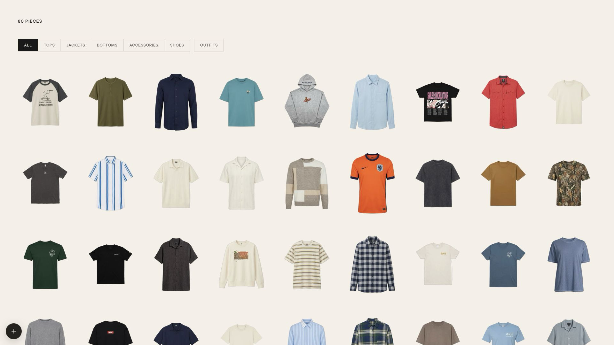
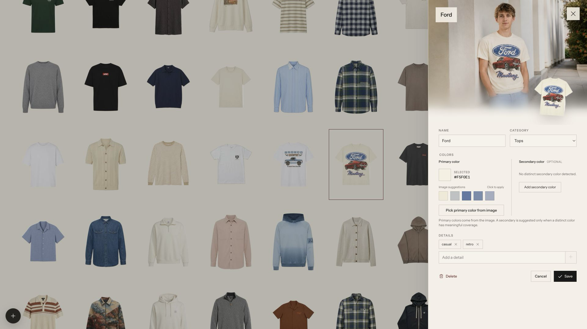

<div align="center">

# Wardrobe

Your clothes, extracted and organized with your choice of AI provider.

[](LICENSE)
[](package.json)

[See the original post →](https://x.com/cdngdev/status/2076812846793650485)

</div>





## Quick start

```bash
git clone https://github.com/tandpfun/wardrobe.git
cd wardrobe
npm install
cp .env.example .env
npm run dev
```

⚠️ The importer stays disabled until you add the API key for your selected provider to `.env`. A user needs at least one profile reference photo only when they request a modeled look.

Open [localhost:5173](http://localhost:5173).

## Import with Codex

This repo includes two Codex skills: one imports clothes and generates modeled item photos; the other styles complete outfits and generates a modeled lookbook.

```text
$import-clothes Import the clothes from ~/Pictures/outfits, create modeled photos, and add them to this wardrobe.
$generate-outfits Create modeled outfit ideas from my wardrobe.
```

Open the cloned repo in Codex and run either prompt. The import skill asks for a local model-reference PNG when needed, reviews every cutout and modeled photo, then writes to `data/library.json` and `data/imported/`. The outfit skill asks how many looks to create, then curates, generates, verifies, and saves the complete collection under `data/`.

### For agents

If you are setting up Wardrobe for a user, ask how they want to import their clothes:

- **Codex:** Ask for a folder or camera-roll location and a model-reference PNG, then extract, model, and import the individual pieces by following [the bundled import skill](.agents/skills/import-clothes/SKILL.md). Afterward, offer to create a requested number of modeled looks with [the outfit-generation skill](.agents/skills/generate-outfits/SKILL.md).
- **Web UI:** Help the user configure OpenRouter or OpenAI, then create a personal profile with reference photos and let them import through the app.

## What it does

- Detects every garment in a photo with structured multimodal analysis
- Extracts clean product cutouts with reference-image editing
- Generates and saves a modeled editorial look only when requested from an item's detail panel
- Supports multiple local users with separate clothes, references, active imports, sizing, style, and preferences
- Keeps originals, jobs, generated images, and the JSON database local in `data/`
- Supports drag, drop, paste, editing, review, regeneration, and approval
- Shows the original uploaded photo by default, then lets a modeled item toggle between its generated look and source

## User profiles

Use the wardrobe switcher in the top-right corner to add a person, edit the current profile, or change wardrobes. Every profile contains:

- a name and optional age
- one to three identity-reference photos
- fashion style, sizing and fit notes, and free-form preferences
- its own visible clothes and in-progress imports

The original single-user wardrobe is assigned to the initial `My wardrobe` profile automatically. Existing local browser edits and deletions are also preserved for that profile. New garments and jobs are tagged with their owner, so switching profiles cannot mix wardrobes. Profile references and preferences are included only in that user's future modeled-image requests.

## Configuration

The checked-in `.env.example` uses a low-cost OpenRouter mix:

| Stage | Model |
| --- | --- |
| Garment detection and metadata | `google/gemini-3.1-flash-lite` |
| Clean garment reconstruction | `google/gemini-3.1-flash-lite-image` |
| Modeled editorial image | `google/gemini-3.1-flash-lite-image` |

Add your key and start the app:

```dotenv
WARDROBE_AI_PROVIDER=openrouter
OPENROUTER_API_KEY=sk-or-v1-your-key
```

`WARDROBE_AI_PROVIDER` is optional: Wardrobe automatically selects OpenRouter when `OPENROUTER_API_KEY` is present, otherwise it falls back to direct OpenAI.

### Model presets

| Preset | `OPENROUTER_GARMENT_MODEL` | `OPENROUTER_MODELED_MODEL` |
| --- | --- | --- |
| Cheapest (default) | `google/gemini-3.1-flash-lite-image` | `google/gemini-3.1-flash-lite-image` |
| Balanced | `google/gemini-3.1-flash-lite-image` | `google/gemini-3.1-flash-image` |
| Highest fidelity | `google/gemini-3.1-flash-image` | `google/gemini-3-pro-image` |

The garment and modeled stages can use different image models because a clean single-product reconstruction is simpler than preserving both a person's identity and a garment in one scene.

When the primary image model returns a content-policy refusal such as `PROHIBITED_CONTENT` or `IMAGE_SAFETY`, Wardrobe automatically retries the same request with the models in `OPENROUTER_IMAGE_FALLBACK_MODELS`. Other failures—authentication, credits, rate limits, networking, and invalid configuration—are not hidden by this fallback. The default is `bytedance-seed/seedream-4.5`, which supports the app's multiple reference images and 3:2 modeled output. Set the value to `none` to disable the fallback.

### OpenRouter settings

| Variable | Default |
| --- | --- |
| `OPENROUTER_API_KEY` | Required when using OpenRouter |
| `OPENROUTER_API_BASE_URL` | `https://openrouter.ai/api/v1` |
| `OPENROUTER_VISION_MODEL` | `google/gemini-3.1-flash-lite` |
| `OPENROUTER_GARMENT_MODEL` | `google/gemini-3.1-flash-lite-image` |
| `OPENROUTER_MODELED_MODEL` | `google/gemini-3.1-flash-lite-image` |
| `OPENROUTER_IMAGE_FALLBACK_MODELS` | `bytedance-seed/seedream-4.5` |
| `OPENROUTER_IMAGE_FALLBACK_PROVIDER` | `seed` |
| `OPENROUTER_IMAGE_QUALITY` | `auto` |
| `OPENROUTER_ZDR` | `true` |
| `OPENROUTER_IMAGE_PROVIDER` | Automatic |
| `WARDROBE_AI_CONCURRENCY` | `2` |

`OPENROUTER_ZDR=true` restricts the analysis request to zero-data-retention routes. With the default Google image models, Wardrobe also pins image requests to `google-vertex/global`, rather than Google AI Studio. The default Seedream fallback is pinned to OpenRouter's current `seed` ZDR endpoint. If you choose another fallback model, review the live [OpenRouter ZDR endpoint list](https://openrouter.ai/api/v1/endpoints/zdr) and update or clear `OPENROUTER_IMAGE_FALLBACK_PROVIDER`.

Wardrobe downsizes provider-bound reference images to a maximum 2048-pixel edge and keeps at most `WARDROBE_AI_CONCURRENCY` image generations in flight. This preserves enough detail for the 1K outputs while avoiding oversized parallel uploads from phone photos.

### Direct OpenAI settings

Existing OpenAI configuration remains supported:

| Variable | Default |
| --- | --- |
| `OPENAI_API_KEY` | Required when using OpenAI |
| `OPENAI_API_BASE_URL` | `https://api.openai.com/v1` |
| `OPENAI_VISION_MODEL` | `gpt-5.4-mini` |
| `OPENAI_IMAGE_MODEL` | `gpt-image-2` |
| `OPENAI_IMAGE_QUALITY` | `high` |

### Local-first boundary

Your database, user profiles, import jobs, originals, and generated assets stay in the local `data/` directory. AI processing is not fully local: the imported photo and garment crop are sent to OpenRouter or OpenAI. The current user's reference photos and profile styling context are sent only when that user explicitly requests a modeled look. API keys stay on the local Vite server and are never exposed to the browser bundle.

Other settings:

| Variable | Default |
| --- | --- |
| `WARDROBE_DEFAULT_USER_NAME` | `My wardrobe` |
| `WARDROBE_ACCESS_PASSWORD` | Empty locally; required before public deployment |
| `WARDROBE_MODEL_REFERENCE` | Legacy first-run reference: `data/model-reference.png` |
| `WARDROBE_MODEL_REFERENCES` | Optional legacy first-run list of 2–3 person photos |
| `WARDROBE_DATA_DIR` | `data` |
| `WARDROBE_BACKFILL_ORIGINAL_FOCUS` | `false`; set to `true` to analyze and save framing metadata for older stored originals |

On the first multi-user startup, the legacy reference setting is copied into the initial profile. After that, manage reference photos from the profile editor. For a fresh checkout, this optional bootstrap configuration still works:

```dotenv
WARDROBE_MODEL_REFERENCES=data/model-front.jpg,data/model-three-quarter.jpg,data/model-full-body.jpg
```

Wardrobe sends the selected user's references first and the garment last, with an explicit prompt describing each image's role. Only three person references are stored per profile.

## Download and restore your data

Open the wardrobe switcher and choose **Download all data**. Wardrobe creates an authenticated `.tar.gz` backup containing:

- every user profile and its 1–3 reference photos
- all clothing metadata, cutouts, original uploads, and modeled images
- unfinished import jobs, including their review state

The archive does **not** contain `.env`, the shared access password, or OpenRouter/OpenAI keys. Item edits are stored in the portable server database; before downloading, Wardrobe automatically migrates older browser-only edits and deletions for every configured user.

To restore the backup into a local checkout:

```bash
tar -xzf wardrobe-personal-data-YYYY-MM-DD.tar.gz
mv data data-before-restore
cp -R wardrobe-data/data ./data
cp .env.example .env
npm install
npm run dev
```

Add your own AI key to the new `.env`. Keep `data-before-restore` until you have verified the restored wardrobe. The downloaded archive includes a `RESTORE.txt` copy of these instructions.

## Deploy privately on Railway

Wardrobe includes a production Node server, a Railway health check, and a shared-password wall. The password protects the profiles, wardrobe records, reference photos, originals, generated photos, and import endpoints. It is deliberately a shared household password, not separate login accounts: anyone who knows it can switch between all configured wardrobes.

One Railway Hobby workspace can contain this alongside another project. The plan's included usage is shared across the whole workspace, so both projects contribute to the same monthly total.

### First deployment without GitHub

Install and sign in to the [Railway CLI](https://docs.railway.com/cli), then run from this repository:

```bash
railway init --name wardrobe
railway up
```

The first upload creates the service. Do not generate a public domain yet. In the Railway project:

1. Add a volume to the Wardrobe service and mount it at `/data`.
2. Add the service variables below. Use Railway's sealed/secret value option for the password and API key.
3. Redeploy the service.
4. Open the volume browser with `railway volume browse` and upload the **contents** of the local `data/` directory into the volume root. Restart once after the transfer.
5. In the service's Networking settings, choose **Generate Domain**. Railway terminates HTTPS automatically.

```dotenv
WARDROBE_DATA_DIR=/data
WARDROBE_ACCESS_PASSWORD=a-unique-random-password-of-at-least-20-characters
WARDROBE_AI_PROVIDER=openrouter
OPENROUTER_API_KEY=sk-or-v1-your-key
OPENROUTER_ZDR=true
```

Generate the password locally with `openssl rand -base64 24`; do not reuse an account password. `railway.json` tells Railway to build with `npm run build`, run the production server with `npm start`, and probe `/healthz`.

If you do not want to move the existing local wardrobe, skip the volume upload and the app will initialize a fresh one. Never upload `.env`; copy each value into Railway's Variables screen.

### Cost and storage

The Railway Hobby plan has a $5 monthly subscription that includes $5 of resource usage across the workspace. CPU, memory, public-network egress, volumes, and any other metered infrastructure for both projects draw from that allowance. OpenRouter or OpenAI usage is billed separately by that provider.

At current Railway rates, persistent volumes cost $0.15 per GB-month. A 1 GB photo library is about $0.15/month and the Hobby volume limit is 5 GB. For this small app, the always-running service's CPU and memory will normally matter more than photo storage.

To inspect it, open the account/workspace switcher in Railway, choose the Hobby workspace, and open **Usage**. Expand **Usage by project** to compare the current and estimated cost of the customer project and Wardrobe. Set a custom email alert before adding a hard compute limit; a hard limit takes all workloads in that workspace offline when reached.

Railway also offers private S3-compatible Buckets at a lower per-GB storage rate. Moving images there is a sensible later optimization, but the JSON database still needs durable storage. Supabase Storage is another option; if used, keep the bucket private and serve signed URLs. Its Free plan currently includes 1 GB of files and 5 GB egress, but inactive Free projects can pause after seven days and the Free plan does not include automatic database backups. Storage objects still need a separate backup. The Railway volume is the simplest and most reliable first deployment.

### Security checklist

- Set `WARDROBE_ACCESS_PASSWORD` before generating the public domain. Rotate it if it is shared outside the intended group.
- Keep `OPENROUTER_API_KEY`, `OPENAI_API_KEY`, and the access password in Railway variables only. Never use a `VITE_` prefix for secrets.
- Keep a single service replica. The JSON store and attached volume are not safe for concurrent writers, and Railway volumes do not support horizontal replicas.
- Turn on volume backups and periodically download an off-platform copy. A password wall does not replace a backup.
- Leave `OPENROUTER_ZDR=true` if the selected routes support it. Imports send clothing photos to the configured AI provider; profile reference photos are sent only for explicitly requested modeled looks.
- Do not use a public Supabase or S3 bucket for these photos. Use a private bucket plus short-lived signed URLs if storage is moved later.
- Review Railway logs after deployment. The server logs AI model, status, duration, token usage, and reported provider cost, but never logs API keys or image contents.

## License

[MIT](LICENSE)
