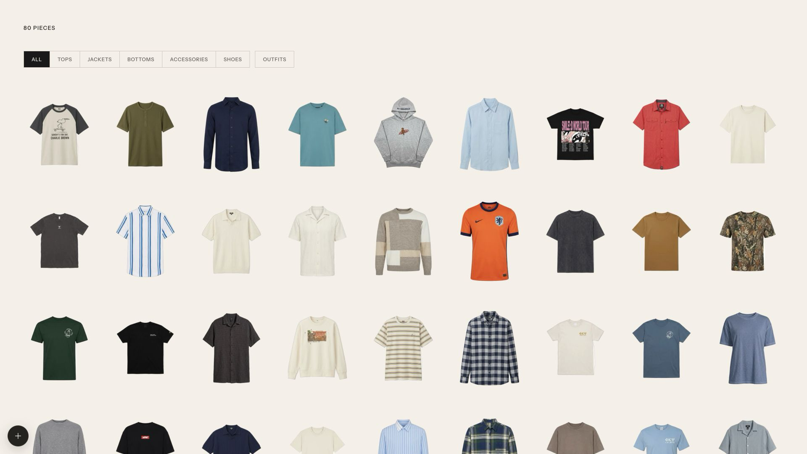
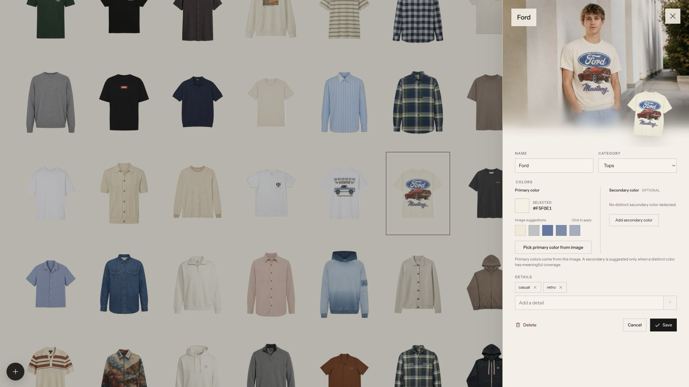

<div align="center">

# Wardrobe

Your clothes, extracted and organized with your choice of AI provider.

[](LICENSE)
[](package.json)

[See the original post →](https://x.com/cdngdev/status/2076812846793650485)

</div>





## Quick start

```bash
git clone https://github.com/tandpfun/wardrobe.git
cd wardrobe
npm install
cp .env.example .env
npm run dev
```

To enable the local background-mask editor, install its Python 3.12 runtime once and point Wardrobe at it:

```bash
python3.12 -m venv .venv
.venv/bin/pip install -r requirements.txt
echo 'REMBG_PYTHON=.venv/bin/python' >> .env
```

The segmentation model runs locally through ONNX. It uses CPU/RAM rather than LLM tokens or image-generation credits; its weights are downloaded on first use. Railway detects the included Python version and requirements files automatically.

⚠️ The importer stays disabled until you add the API key for your selected provider to `.env`. A user needs at least one profile reference photo only when they request a modeled look.

Open [localhost:5173](http://localhost:5173).

## Import with Codex

This repo includes two Codex skills: one imports clothes and generates modeled item photos; the other styles complete outfits and generates a modeled lookbook.

```text
$import-clothes Import the clothes from ~/Pictures/outfits, create modeled photos, and add them to this wardrobe.
$generate-outfits Create modeled outfit ideas from my wardrobe.
```

Open the cloned repo in Codex and run either prompt. The import skill asks for a local model-reference PNG when needed, reviews every cutout and modeled photo, then writes to `data/library.json` and `data/imported/`. The outfit skill asks how many looks to create, then curates, generates, verifies, and saves the complete collection under `data/`.

### For agents

If you are setting up Wardrobe for a user, ask how they want to import their clothes:

- **Codex:** Ask for a folder or camera-roll location and a model-reference PNG, then extract, model, and import the individual pieces by following [the bundled import skill](.agents/skills/import-clothes/SKILL.md). Afterward, offer to create a requested number of modeled looks with [the outfit-generation skill](.agents/skills/generate-outfits/SKILL.md).
- **Web UI:** Help the user configure OpenRouter or OpenAI, then create a personal profile with reference photos and let them import through the app.

## What it does

- Detects every garment in a photo with structured multimodal analysis
- Extracts clean product cutouts with reference-image editing
- Generates and saves multiple modeled editorial looks only when requested from an item's detail panel
- Animates any saved modeled look into a persistent 4–10 second vertical clip, with movement, frame anchoring, resolution, optional synchronized sound, and a live price estimate
- Supports multiple local users with separate clothes, references, active imports, sizing, style, and preferences
- Searches names, brands, and tags with color, size, fit, material, and season facets
- Saves reusable filter, sorting, and grid-density combinations per profile
- Switches between a clean garments-only gallery and configurable product details, with optional white or softly colored image tiles
- Plans trips and events from seasonal destination conditions, personal preferences, and the clothes already available
- Keeps originals, jobs, generated images, and the JSON database local in `data/`
- Supports drag, drop, paste, editing, review, regeneration, and approval
- Lets modeled items rotate through saved looks, open the complete original source, and delete individual generated images from storage
- Previews four suggested or any custom garment color instantly in the browser, with separate primary/secondary targeting for multicolor pieces
- Stores optional garment brands, purchase months, and prices, with an oldest-purchase-first organization mode
- Shows local brand marks beside garments, brand suggestions, and brand filters, with monogram fallbacks for custom labels

## User profiles

Use the wardrobe switcher in the top-right corner to add a person, edit the current profile, or change wardrobes. Every profile contains:

- a name and optional age
- one to three identity-reference photos
- fashion style and free-form preferences
- a regional sizing system with multiple saved size labels for tops, bottoms, outerwear, shoes, and rings
- a preferred fit plus optional brand-specific sizing notes
- a preferred currency shared by every garment price
- preferred materials and favorite colors for styling context
- a saved interface and AI-response language: US English or European Portuguese
- separate preferred AI models for analysis, garment reconstruction, one-reference and multi-reference modeled looks, modeled-look video, and trip planning
- a private per-person AI cost summary recorded from provider responses
- saved wardrobe views and weather-aware trip/event plans
- its own visible clothes and in-progress imports

The original single-user wardrobe is assigned to the initial `My wardrobe` profile automatically. Existing local browser edits and deletions are also preserved for that profile. New garments and jobs are tagged with their owner, so switching profiles cannot mix wardrobes. Profile references and preferences are included only in that user's future modeled-image requests.

### Languages

Choose **Edit profile → Personal → Language** to use Wardrobe in US English or European Portuguese. The choice belongs to that person, follows them when wardrobes are switched, and is included in personal-data exports. It localizes the complete interface, validation and provider errors, import workflow, planner, filters, dialogs, accessibility labels, and browser title. New AI garment metadata and trip plans are also requested in the selected language; existing user-entered names and tags are never rewritten automatically.

## Configuration

The checked-in `.env.example` uses a low-cost OpenRouter mix:

| Stage | Model |
| --- | --- |
| Garment detection and metadata | `google/gemini-3.1-flash-lite` |
| Trip and event planning | `google/gemini-3.1-flash-lite` |
| Clean garment reconstruction | `black-forest-labs/flux.2-klein-4b` |
| Modeled editorial image, one identity reference | `google/gemini-3.1-flash-lite-image` |
| Modeled editorial image, two or three identity references | `google/gemini-3.1-flash-image` |
| Modeled-look video | `bytedance/seedance-1-5-pro` |

Add your key and start the app:

```dotenv
WARDROBE_AI_PROVIDER=openrouter
OPENROUTER_API_KEY=sk-or-v1-your-key
```

`WARDROBE_AI_PROVIDER` is optional: Wardrobe automatically selects OpenRouter when `OPENROUTER_API_KEY` is present, otherwise it falls back to direct OpenAI.

Wardrobe identifies every OpenRouter request with `HTTP-Referer` and
`X-OpenRouter-Title`, so usage appears as **Wardrobe** instead of **Unknown** in
OpenRouter's Apps analytics. Railway deployments use
`RAILWAY_PUBLIC_DOMAIN` automatically. Set `OPENROUTER_APP_URL` when you want a
custom domain to be the canonical identifier, and optionally change
`OPENROUTER_APP_TITLE`.

### Model presets

| Preset | `OPENROUTER_GARMENT_MODEL` | One reference | Two or three references |
| --- | --- | --- | --- |
| Adaptive economy (default) | `bytedance-seed/seedream-4.5` | `google/gemini-3.1-flash-lite-image` | `google/gemini-3.1-flash-image` |
| Private | `google/gemini-3.1-flash-lite-image` | `google/gemini-3.1-flash-lite-image` | `google/gemini-3.1-flash-image` |
| Highest fidelity | `google/gemini-3.1-flash-image` | `google/gemini-3.1-flash-image` | `google/gemini-3-pro-image` |

The garment and modeled stages can use different image models because a clean single-product reconstruction is simpler than preserving both a person's identity and a garment in one scene. Wardrobe also selects the modeled-look model by profile: one identity reference uses `OPENROUTER_MODELED_MODEL`, while two or three references use `OPENROUTER_MODELED_MULTI_REFERENCE_MODEL`. Video uses `OPENROUTER_VIDEO_MODEL`; the default Seedance 1.5 Pro route is the lowest-cost listed model that supports all four UI durations, 480p–1080p, optional audio, and first- or last-frame control. The values below remain the server defaults; each person can override the six AI tasks from **Edit profile → AI & costs**.

The profile selector lists only models compatible with each task: multimodal text-output models for photo analysis, text models for planning, and image-output models for garment reconstruction and modeled looks. Each task has a preferred model and an optional, distinct backup model. Each choice shows the current OpenRouter list price recorded when this release was built. OpenRouter may change prices later, and the exact returned request cost remains authoritative. The retired invalid ID `google/gemini-3.1-flash` is automatically migrated to `google/gemini-3.6-flash` in saved profiles and server environment values.

Seedream 4.5 is the recommended garment route because its per-image price is predictable and it currently has a zero-data-retention route. Klein remains the lowest-price option, but it is not currently available under OpenRouter Zero Data Retention. `OPENROUTER_ALLOW_NON_ZDR_GARMENT=true` is therefore an explicit, garment-only privacy exception when Klein is selected.

When the primary image model returns a content-policy refusal such as `PROHIBITED_CONTENT` or `IMAGE_SAFETY`, Wardrobe automatically retries the same request with the models in `OPENROUTER_IMAGE_FALLBACK_MODELS`. No image exists to review in that case. If a garment model does return an image but it fails the local resolution or transparency rules, Wardrobe preserves that paid result and pauses for user review; it does not call the fallback until the user explicitly chooses the alternative model. Garment fidelity is confirmed by the side-by-side user review rather than a second paid vision-model call. Authentication, credits, rate limits, networking, and invalid configuration are not hidden by an image fallback. The default alternative is `bytedance-seed/seedream-4.5`, which supports the app's multiple reference images and 3:2 modeled output. It starts at 4K because the current Seed route rejects the smaller concrete dimensions derived from lower resolution tiers for some reference-image requests. Set the fallback-model value to `none` to disable it.

The planner asks OpenRouter for a JSON object and validates the returned structure locally. This avoids provider-specific failures caused by sending a large, deeply nested strict schema to Gemini while retaining predictable saved plan data. When the selected planner route is unavailable or returns malformed JSON, Wardrobe retries the models in `OPENROUTER_PLANNER_FALLBACK_MODELS` in order. The default fallback is the inexpensive, ZDR-compatible `google/gemini-2.5-flash-lite`; set the variable to `none` to disable planner fallback.

### OpenRouter settings

| Variable | Default |
| --- | --- |
| `OPENROUTER_API_KEY` | Required when using OpenRouter |
| `OPENROUTER_API_BASE_URL` | `https://openrouter.ai/api/v1` |
| `OPENROUTER_APP_URL` | Railway public domain, or the local app URL outside Railway |
| `OPENROUTER_APP_TITLE` | `Wardrobe` |
| `OPENROUTER_VISION_MODEL` | `google/gemini-3.1-flash-lite` |
| `OPENROUTER_PLANNER_MODEL` | `OPENROUTER_VISION_MODEL` |
| `OPENROUTER_PLANNER_FALLBACK_MODELS` | `google/gemini-2.5-flash-lite` |
| `OPENROUTER_GARMENT_MODEL` | `bytedance-seed/seedream-4.5` in `.env.example` |
| `OPENROUTER_MODELED_MODEL` | `google/gemini-3.1-flash-lite-image` |
| `OPENROUTER_MODELED_MULTI_REFERENCE_MODEL` | `google/gemini-3.1-flash-image` |
| `OPENROUTER_VIDEO_MODEL` | `bytedance/seedance-1-5-pro` |
| `OPENROUTER_IMAGE_FALLBACK_MODELS` | `bytedance-seed/seedream-4.5` |
| `OPENROUTER_ALLOW_NON_ZDR_GARMENT` | `false` in `.env.example` |
| `OPENROUTER_GARMENT_PROVIDER` | Automatic |
| `OPENROUTER_MODELED_PROVIDER` | Automatic |
| `OPENROUTER_IMAGE_FALLBACK_PROVIDER` | `seed` |
| `OPENROUTER_IMAGE_RESOLUTION` | `1K` |
| `OPENROUTER_IMAGE_FALLBACK_RESOLUTION` | `4K` |
| `OPENROUTER_IMAGE_QUALITY` | `auto` |
| `OPENROUTER_ZDR` | `true` |
| `OPENROUTER_IMAGE_PROVIDER` | Automatic |
| `WARDROBE_AI_CONCURRENCY` | `2` |
| `WARDROBE_AI_REFERENCE_MAX_EDGE` | `1536` |
| `WARDROBE_AI_REFERENCE_JPEG_QUALITY` | `84` |

`OPENROUTER_ZDR=true` restricts the analysis request to zero-data-retention routes. With Google image models, Wardrobe also pins modeled-image requests to `google-vertex/global`, rather than Google AI Studio. The default Seedream fallback is pinned to OpenRouter's current `seed` ZDR endpoint. The Klein exception is limited to the garment stage and must be enabled explicitly with `OPENROUTER_ALLOW_NON_ZDR_GARMENT=true`. If you choose another fallback model, review the live [OpenRouter ZDR endpoint list](https://openrouter.ai/api/v1/endpoints/zdr) and update or clear `OPENROUTER_IMAGE_FALLBACK_PROVIDER`.

Wardrobe downsizes provider-bound reference images to a maximum 1536-pixel edge and recompresses photos at JPEG quality 84 before upload. Both values are configurable, with safe bounds, through `WARDROBE_AI_REFERENCE_MAX_EDGE` and `WARDROBE_AI_REFERENCE_JPEG_QUALITY`. It also keeps at most `WARDROBE_AI_CONCURRENCY` image generations in flight. Primary models that expose normalized dimensions stay at 1K; Gemini 3.1 Flash Lite Image supports only 1K, and Klein currently chooses its own output dimensions because its OpenRouter endpoint does not advertise `resolution` or `aspect_ratio`. Safety fallbacks start at 2K. If OpenRouter reports that a concrete size is below an upstream route's minimum, Wardrobe retries the same model at the next supported resolution tier instead of showing the raw provider error.

### Direct OpenAI settings

Existing OpenAI configuration remains supported:

| Variable | Default |
| --- | --- |
| `OPENAI_API_KEY` | Required when using OpenAI |
| `OPENAI_API_BASE_URL` | `https://api.openai.com/v1` |
| `OPENAI_VISION_MODEL` | `gpt-5.4-mini` |
| `OPENAI_PLANNER_MODEL` | `OPENAI_VISION_MODEL` |
| `OPENAI_IMAGE_MODEL` | `gpt-image-2` |
| `OPENAI_IMAGE_QUALITY` | `high` |

### Local-first boundary

Your database, user profiles, import jobs, originals, and generated assets stay in the local `data/` directory. AI processing is not fully local: the imported photo and garment crop are sent to OpenRouter or OpenAI. The current user's reference photos are sent only when that user explicitly requests a modeled look. A video request sends the selected modeled image as its exact first or last frame, the matching clean garment image as a separate fidelity reference, and the movement and sound direction to OpenRouter. Wardrobe then temporarily polls the provider until the clip can be downloaded into local storage. Completed clips preload behind their modeled images and play silently on hover in a seamless forward-and-back loop. OpenRouter video generation is asynchronous and is not eligible for Zero Data Retention. Requesting a trip/event plan sends the destination, dates, trip notes, relevant profile preferences, and clothing metadata—but no wardrobe or reference images—to the configured provider. API keys stay on the local server and are never exposed to the browser bundle.

Wardrobe keeps every original garment and modeled image intact and automatically creates lightweight WebP derivatives beside it: 320-pixel garment thumbnails for the gallery, 1040-pixel previews for the item panel, and 192-pixel profile avatars. Existing libraries and profile references are backfilled once at startup, while new garments, modeled looks, and avatars are optimized as they are saved. Only the derivatives receive long-lived private browser caching; originals remain uncached and are still included in personal-data exports.

Other settings:

| Variable | Default |
| --- | --- |
| `WARDROBE_DEFAULT_USER_NAME` | `My wardrobe` |
| `GOOGLE_CLIENT_ID` | Required; Wardrobe refuses all access until it is set |
| `GOOGLE_CLIENT_SECRET` | Required; from the same Google OAuth client |
| `WARDROBE_ALLOWED_EMAILS` | Required; the Google addresses allowed to sign in, optionally pinned to a profile id |
| `WARDROBE_SESSION_SECRET` | Falls back to `GOOGLE_CLIENT_SECRET` |
| `WARDROBE_MODEL_REFERENCE` | Legacy first-run reference: `data/model-reference.png` |
| `WARDROBE_MODEL_REFERENCES` | Optional legacy first-run list of 2–3 person photos |
| `WARDROBE_DATA_DIR` | `data` |
| `WARDROBE_BACKFILL_ORIGINAL_FOCUS` | `false`; set to `true` to analyze and save framing metadata for older stored originals |

On the first multi-user startup, the legacy reference setting is copied into the initial profile. After that, manage reference photos from the profile editor. For a fresh checkout, this optional bootstrap configuration still works:

```dotenv
WARDROBE_MODEL_REFERENCES=data/model-front.jpg,data/model-three-quarter.jpg,data/model-full-body.jpg
```

Wardrobe sends the selected user's references first and the garment last, with an explicit prompt describing each image's role. Only three person references are stored per profile.

### Search, saved views, and planner

The wardrobe filter rail searches names, brands, and tags and combines facets with AND logic across categories and OR logic within a category. Garments can store their own size labels, fit, materials, and seasons in the item panel. Older garments remain searchable by material or fit when those values already exist as tags.

Saved views belong to the current profile and include the search, category, selected facets, sorting mode, and grid density. They are stored in `users.json` and included in personal-data exports.

Each profile also stores its wardrobe showcase preference. Use the top **Garments / Details** toggle for a quick switch, then open **Edit profile → Wardrobe** to choose which fields appear in Details mode and whether garment images use no background or a white, beige, light-blue, soft-grey, or blush tile. These settings travel with personal-data exports.

The trip/event planner uses the configured planner model as a low-cost structured text model. It combines the destination, dates, plans, profile preferences, sizing, and wardrobe metadata; it does not upload clothing or reference images. Weather guidance is based on expected seasonal climate rather than a live forecast, and every plan says to check a current forecast near departure. Generated plans and missing-item suggestions are saved with the current profile and included in exports.

OpenRouter includes exact cost and token usage in generation responses. Wardrobe records those values—including the final cost returned when a video job completes—in `data/ai-usage.json`, attributed to the active person, task, and model. The **AI & costs** profile tab summarizes them without exposing the API key or calling an account-wide billing endpoint. Tracking starts after this feature is installed, so older calls are not reconstructed; failed calls and direct-provider responses without a reported price are counted as unpriced requests.

Color previews are browser-only canvas transformations. They preserve the cutout's lightness, shadows, texture, and transparency while changing pixels that match the selected primary or secondary color. They do not call an AI provider, create another stored image, or modify the garment's saved color metadata.

The Adidas, Nike, Zara, H&M, and Uniqlo vector paths are bundled from the CC0-licensed [Simple Icons](https://github.com/simple-icons/simple-icons) project. Other built-in retailers use compact local wordmark badges, and custom brands receive an automatically generated monogram. Brand names and marks remain trademarks of their respective owners.

## Download and restore your data

Open the wardrobe switcher and choose **Download all data**. Wardrobe finishes and integrity-checks the backup before the download starts. It uses a Finder/File Explorer-friendly `.zip` on macOS and Windows, and `.tar.gz` on Linux. Both formats contain:

- every user profile and its 1–3 reference photos
- all clothing metadata, cutouts, original uploads, modeled images, and generated modeled-look videos
- unfinished import jobs, including their review state
- the local per-person AI usage and cost ledger

The archive does **not** contain `.env`, Google OAuth/session secrets, or OpenRouter/OpenAI keys. Item edits are stored in the portable server database; before downloading, Wardrobe automatically migrates older browser-only edits and deletions for every configured user.

To restore the backup into a local checkout:

```bash
# macOS or Windows (also opens directly in Finder or File Explorer)
unzip wardrobe-personal-data-YYYY-MM-DD.zip

# Linux
tar -xzf wardrobe-personal-data-YYYY-MM-DD.tar.gz

mv data data-before-restore
cp -R wardrobe-data/data ./data
cp .env.example .env
npm install
npm run dev
```

Add your own AI key to the new `.env`. Keep `data-before-restore` until you have verified the restored wardrobe. The downloaded archive includes a `RESTORE.txt` copy of these instructions.

## Deploy privately on Railway

Wardrobe supports two persistence configurations:

- local development and tests: JSON plus filesystem storage under `data/`;
- production: PostgreSQL 18 plus a private S3-compatible media bucket.

The production server exposes `/healthz` for process liveness and `/readyz` for
database schema and bucket readiness. Railway uses `/readyz`; the deploy-time
command applies checksum-protected migrations and refuses schema drift.

The complete provisioning, pgBackRest, nightly backups, migration, verification,
cutover, rollback, and 30-day cleanup procedure is in
[Railway Postgres and buckets migration](docs/railway-postgres-migration.md).
Never enable the production drivers until its verification gate succeeds.

### Security checklist

- Set `GOOGLE_CLIENT_ID`, `GOOGLE_CLIENT_SECRET`, and `WARDROBE_ALLOWED_EMAILS` before generating the public domain. Without the allowlist nobody can sign in, which fails closed rather than open.
- Each Google account owns exactly one wardrobe. Profiles cannot be switched, another person's assets return 404, and a personal-data export contains only the signed-in person's data.
- Keep API keys, OAuth secrets, S3 credentials, `WARDROBE_SESSION_SECRET`, and `WARDROBE_DATA_ENCRYPTION_KEY` in server-only Railway variables. Never use a `VITE_` prefix for secrets.
- Keep the encryption-key recovery copy outside Railway. Losing it makes personal encrypted provider keys unrecoverable.
- Keep a single service replica while using filesystem persistence. PostgreSQL removes the whole-file rewrite limitation after cutover.
- Use all three backup layers in the runbook. A login wall and a media bucket do not replace database or recovery backups.
- Leave `OPENROUTER_ZDR=true` if the selected routes support it. Imports send clothing photos to the configured AI provider; profile reference photos are sent only for explicitly requested modeled looks.
- Keep both Railway buckets private. The server authorizes asset ownership and sharing before issuing a five-minute signed redirect.
- Review Railway logs after deployment. The server logs AI model, status, duration, token usage, and reported provider cost, but never logs API keys or image contents.

## License

[MIT](LICENSE)
